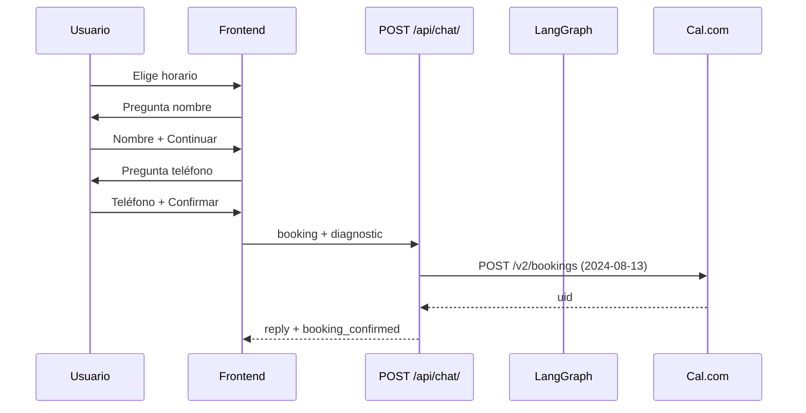
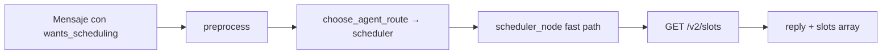

# Bio-Assistent — Referencia técnica

## Diagrama de flujo (agendamiento)



## Listado de slots (sin formulario previo)



## AgentState (sesión Django `agent_state`)

Campos relevantes: `language`, `intent`, `city`, `pest_type`, `property_type`, `technical_notes`, `customer_name`, `history`.

Intents: `quote`, `urgency`, `appointment`, `doubt`, `follow_up`.

## Variables de entorno (agentes + Cal)

| Variable | Uso |
|----------|-----|
| `OPENAI_API_KEY` | Modelo principal (`AGENT_MODEL`, default `openai:gpt-4o-mini`) |
| `CAL_API_KEY` | Slots y bookings |
| `CAL_EVENT_TYPE_ID` | `277401` |
| `CAL_BASE_URL` | `https://api.cal.eu/v2` |
| `CAL_SLOTS_API_VERSION` | Default `2024-09-04` |
| `CAL_BOOKING_API_VERSION` | Default `2024-08-13` (**obligatorio** para crear reservas) |
| `AGENT_HISTORY_MAX_TURNS` | Recorte historial LLM |
| `AGENT_ENABLE_CRM` | `false` omite nodo CRM post-diagnóstico |

## Errores frecuentes

| Síntoma | Causa | Fix |
|---------|-------|-----|
| `Cannot POST /v2/bookings` | `cal-api-version` incorrecta para POST | Usar `2024-08-13` en bookings |
| Slots en respuesta a "hola" | Sesión con `APPOINTMENT` + ruta antigua | `wants_scheduling` + `source: home` |
| Timeout al agendar | LLM scheduler en lugar de fast path | Verificar keywords en mensaje |
| Scroll bloqueado en modal | Lenis captura rueda | `data-lenis-prevent` + `lenis.stop()` |
| Respuesta en español con UI en catalán | `cita` en ES_HINTS | Respetar `language` del request |
| Hint del chat sigue en catalán tras cambiar a ES | `persistent_msg` bajo `verdict` en `es/agent.json` | Duplicar claves a nivel raíz `agent.*` |
| Saludo del chat no cambia de idioma | `useEffect` solo en mount o sin dep `i18n.language` | Re-sincronizar bienvenida si no hay msgs de usuario |

## Claves i18n del chat home (`FloatingCTA`)

| Clave | ca (ejemplo) | es (ejemplo) |
|-------|--------------|--------------|
| `agent.welcome_msg_home` | Hola! Sóc el recepcionista… | ¡Hola! Soy el recepcionista… |
| `agent.persistent_msg` | Estic disponible… | Estoy disponible… |
| `agent.home.title` | Assistent CECSA | Asistente CECSA |
| `agent.home.subtitle` | IA Bio-Conscient | IA Bio-Consciente |

Patrón de sincronización en `FloatingCTA.jsx`:

```javascript
useEffect(() => {
  setMessages((prev) => {
    if (prev.some((m) => m.role === 'user')) return prev;
    if (prev.length === 0 || (prev.length === 1 && prev[0].role === 'assistant')) {
      return [{ role: 'assistant', content: t('agent.welcome_msg_home'), isInitial: true }];
    }
    return prev;
  });
}, [i18n.language, t]);
```
