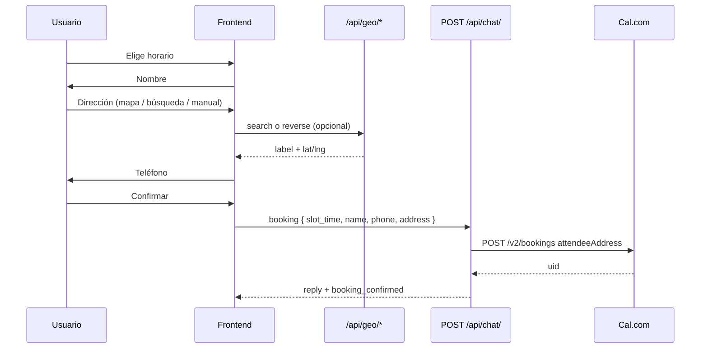
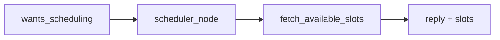

# Bio-Assistent — Referencia técnica

## Diagrama de flujo (agendamiento con dirección)

## Listado de slots (fast path)

## AgentState (sesión Django + deps Pydantic-AI)

`AgentState` (`backend/api/agents/models.py`) unifica el estado del grafo LangGraph y el `deps_type` de todos los agentes Pydantic-AI. En tools y system prompts usar `ctx.deps` (p. ej. `ctx.deps.language`). **No usar** la clase eliminada `AgentDeps`.

Campos relevantes: `language`, `intent`, `city`, `pest_type`, `property_type`, `technical_notes`, `customer_name`, `severity`, `history`.

Intents: `quote`, `urgency`, `appointment`, `doubt`, `follow_up`.

En `graph/nodes.py`, `_run_agent` invoca `agent.run(prompt, deps=agent_state, message_history=history)`.

## Variables de entorno (agentes + Cal)

| Variable | Uso |
|----------|-----|
| `OPENAI_API_KEY` | Modelo principal |
| `CAL_API_KEY` | Slots y bookings |
| `CAL_EVENT_TYPE_ID` | **`278962`** (primerarevision / primeracita) |
| `CAL_BASE_URL` | `https://api.cal.eu/v2` |
| `CAL_SLOTS_API_VERSION` | `2024-09-04` |
| `CAL_BOOKING_API_VERSION` | `2024-08-13` (crear reservas) |
| `CAL_BOOKING_LOCATION_TYPE` | `attendeeAddress` (default; no `integration`) |
| `AGENT_HISTORY_MAX_TURNS` | Recorte historial LLM |
| `AGENT_ENABLE_CRM` | `false` omite nodo CRM |

## Admin agenda

- `GET /api/cal/bookings/` (auth Token) → `fetch_cal_bookings()` en `cal_client.py`
- Respuesta normalizada: `{ status, data: { bookings: [...] } }`
- Cancelar: `POST /api/cal/bookings/<uid>/cancel/` (UID, no id numérico)
- UI: `CalendarManager.jsx` — campos `start` / `startTime`, enlace `app.cal.eu`

## Errores frecuentes

| Síntoma | Causa | Fix |
|---------|-------|-----|
| `Cannot POST /v2/bookings` | API version incorrecta | `2024-08-13` |
| `integration not valid` / solo `attendeeAddress` | Event type presencial + código viejo | `resolve_booking_location` + redeploy |
| Panel admin vacío | Parseo `data.bookings` vs array en `data` | `fetch_cal_bookings` + CalendarManager |
| Slots en «hola» | Sesión `APPOINTMENT` | `source: home` + `wants_scheduling` |
| Dirección «cocina» en Cal | Solo zona del diagnóstico, sin paso address | Flujo 3 pasos + `booking.address` |
| Scroll bloqueado en modal | Lenis | `data-lenis-prevent` + `lenis.stop()` |
| Hint chat en idioma incorrecto | Claves bajo `verdict` en es | Claves a nivel `agent.*` |

## Claves i18n reserva (`agent.booking.*`)

| Clave | Uso |
|-------|-----|
| `ask_name` | Tras elegir slot |
| `ask_address` | Tras nombre |
| `ask_phone` | Tras dirección |
| `address_placeholder` | Input búsqueda |
| `address_hint` | Ayuda mapa + manual |
| `use_gps` | Botón ubicación |

## Claves i18n chat home

`agent.welcome_msg_home`, `agent.persistent_msg`, `agent.home.*` — sincronizar con `i18n.language` si no hay mensajes de usuario (`FloatingCTA.jsx`).
